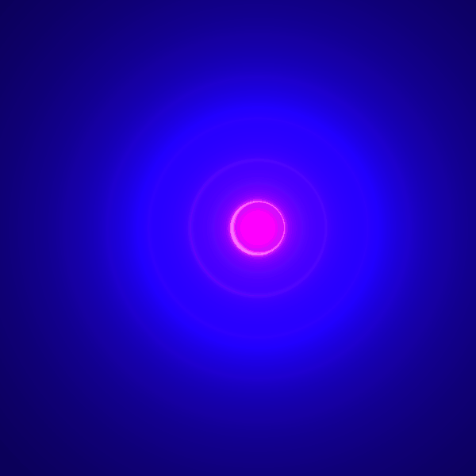

# entregaShader
un programa que utiliza un shader
autor: Samuel Trujillo Santana
## Desctipción
El programa en sí solamente ejecuta el shader, el cuál he hecho partiendo de la base de un shader que saqué de la página shadertoy. El shader original se titula creation, el cuál he modificado.

## Vista del programa funcionando

## Referencias

Guión de prácticas de CIU

Referencias Processing https://processing.org/reference/

bloc de shaders https://www.shadertoy.com

shader creation https://www.shadertoy.com/view/XsXXDn

Librería GifAnimation https://github.com/extrapixel/gif-animation
